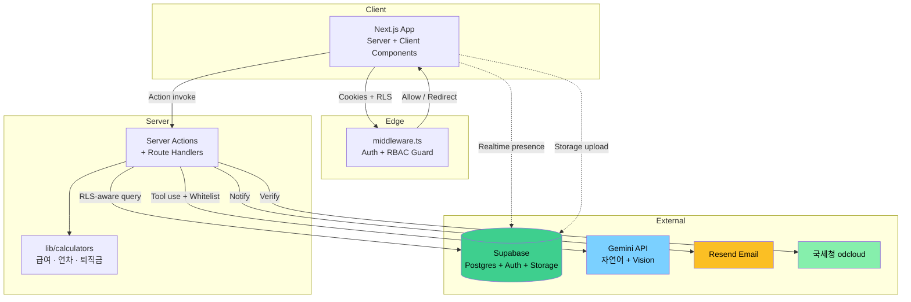

# Nexus ERP — Enterprise Edition

> **중소기업 1인 총무 담당자를 위한 통합 미니 ERP.**
> 직원·근태·급여·연차·지출·자산·결산을 하나로. 근로기준법 자동 준수 + AI 분석.

[](https://github.com/yenooooooo/pro/actions/workflows/ci.yml)
[](https://pro-gules-beta.vercel.app/)
[](https://nextjs.org/)
[](https://supabase.com/)
[](https://aistudio.google.com/)

---

## 🎯 라이브 데모

**https://pro-gules-beta.vercel.app/** → 우측 **"데모 계정으로 둘러보기"** 클릭

가입·암호 입력 없이 1년치 시나리오 데이터 (직원 15명 · 근태 2,700행 · 급여 135건 · 지출 150건+) 로 모든 기능 즉시 체험.

---

## 차별화 14종 (대기업 ERP 가 못 따라오는 부분)

### 🤖 AI 기반 자동화 (Gemini 무료 tier + Tesseract.js fallback)

| 기능 | 단축키/위치 | 동작 |
|---|---|---|
| **Ask Nexus — 자연어 질의** | 상단바 ✨ / `Ctrl+J` | "개발팀 평균 기본급은?" → SQL whitelist 검증 → 답변 + 인사이트 |
| **영수증 OCR 듀얼모드** | 지출 등록 폼 | 사진 1장 → 일자·금액·VAT·거래처 자동 입력. Gemini 우선, 실패 시 Tesseract.js |

### ⚖️ 한국 노무·세무 특화

| 기능 | 근거 |
|---|---|
| **법적 리스크 자동 점검** | 근기법 §53 (주 52h), §60 (연차 촉진), 최저임금법, 매월 10일 신고 마감 |
| **인건비 시뮬레이터** | 채용·일괄 인상·최저임금 변동 시 월/연 비용 임팩트 실시간 계산 |
| **연말정산 자동화** | 소득세법 §45 — 인적공제 + 특별공제 + 누진세율 7단계 자동 |
| **퇴직급여 충당부채** | 근퇴법 §8 — 1년 이상 근속자 누적 충당금 자동 계산 |
| **4대보험 EDI 신고용 CSV** | 직원별 보수월액·근로자/회사 부담 자동 |
| **거래처 진위확인** | 국세청 odcloud API + 사업자번호 체크섬 |

### 🛡️ 운영급 인프라

| 기능 | 비고 |
|---|---|
| **전자결재 다단 결재선** | 1~5단계 결재선 + 단계별 audit log + 이메일 알림 |
| **RBAC 4단계** | admin / hr / finance / employee + 미들웨어 가드 + RLS |
| **감사 로그** | 모든 민감 행위 자동 기록 (28종 액션) |
| **이메일 알림** | Resend — 결재 발의/승인/반려 자동 발송 |
| **PWA + 푸시 인프라** | manifest + service worker, 홈 화면 추가 |
| **실시간 협업 presence** | 같은 페이지 사용자 아바타 (Supabase Realtime) |
| **사이트 투어 + 데모 모드** | 첫 방문 5단계 안내 + 노란 배너 + 24시간 초기화 |

---

## 핵심 모듈 17종

| 모듈 | 경로 | 비고 |
|---|---|---|
| 대시보드 | `/dashboard` | KPI 4종 + 부서별 인건비 + 카테고리별 지출 + 6개월 추세 |
| 직원 정보 | `/employees` | CRUD + 엑셀 가져오기 + 근태/급여/연차 탭 |
| 근태 | `/attendance` | 일별 입력 + CSV 가져오기 + 월별 직원 합계 |
| 급여 | `/payroll` | 일괄 계산 + 명세서 PDF + 엑셀 원장 |
| 연차 | `/leave` | 발생/사용/잔여 + 결재 워크플로우 + 전체 신청 이력 |
| 지출 | `/expenses` | OCR 자동 등록 + 카테고리/거래처 + 월별 원장 |
| 거래처 | `/vendors` | 사업자번호 진위확인 + 계약 만료 알림 |
| 자산 | `/assets` | 정액법 감가상각 + 내용연수 추적 + 잔존가 |
| 월말결산 | `/closing` | 8단계 체크리스트 + 종합 PDF 리포트 |
| 전자결재 | `/approvals` | 다단 결재선 + 이메일 알림 |
| 법적 리스크 | `/risks` | 5종 자동 점검 |
| 인건비 시뮬 | `/simulator` | 슬라이더 4개로 What-if 분석 |
| 퇴직급여 | `/retirement` | 충당부채 자동 계산 + 부서별 + 엑셀 export |
| 연말정산 | `/year-end` | 직원별 공제 입력 + 결정세액 추정 |
| 시스템 설정 | `/settings` | 4대보험 요율 편집 + 결산 체크리스트 관리 |
| 감사 로그 | `/audit-logs` | 액션 필터 + 페이지네이션 |
| 리포트 생성 | 사이드바 버튼 | xlsx 9종 + PDF 1종 |

---

## 기술 스택

### Frontend
- **Next.js 14** App Router · Server Components · Server Actions
- **TypeScript** strict
- **Tailwind CSS** + 자체 디자인 토큰 (Stitch "Executive Command")
- **React Hook Form** + **Zod**
- **Recharts** (dynamic import)
- **lucide-react**

### Backend & DB
- **Supabase** PostgreSQL + Auth + Storage + Realtime
- **Row Level Security** — 역할 기반 데이터 격리
- **Server Actions** + Route Handlers

### AI
- **Google Gemini 2.5 Flash** (무료 tier — 자연어 + Vision OCR)
- **Tesseract.js** (오프라인 fallback)

### 외부 연동
- **Resend** (이메일, 무료 100건/일)
- **국세청 odcloud API** (사업자번호 진위)

### 인프라
- **Vercel** (배포 + Preview + Analytics)
- **GitHub Actions** (lint · typecheck · test · build CI)
- **ExcelJS** (xlsx 생성)
- **PWA** (자체 SW + Manifest)

---

## 아키텍처



---

## 비즈니스 로직 정확성

```ts
// lib/calculators/payroll.ts — 근기법 §56
export const MONTHLY_REGULAR_HOURS = 209;        // 40h × 365/7/12 ≈ 4.345주
export const OVERTIME_RATE = 1.5;
export const NIGHT_RATE_PREMIUM = 0.5;           // 22~06시 가산분
export const HOLIDAY_RATE_WITHIN_8H = 1.5;
export const HOLIDAY_RATE_OVER_8H = 2.0;
export const MEAL_TAX_FREE_LIMIT = 200_000;      // 월 20만원 비과세
```

```ts
// lib/calculators/leave.ts — 근기법 §60
function calculateAnnualLeave(hireDate, baseDate): number {
  if (years < 1) return Math.min(11, monthsServed);     // 1년 미만 월차
  if (years < 3) return 15;                             // 1~2년차
  return Math.min(25, 15 + Math.floor((years - 1) / 2)); // 3년차+ 가산
}
```

**4대보험 요율은 하드코딩 금지** — `chongmu.insurance_rates` 테이블에서 연도별 조회.

---

## 보안

- **RLS 정책 강화** (`supabase/migrations/0011_role_based_rls.sql`)
  - `payroll`: admin/finance 전체, employee 본인만
  - `employees`: admin/hr/finance SELECT, admin/hr 만 modify
  - `audit_logs`: admin 전체, 그 외 본인 액션만
- **계좌번호 마스킹** (`****5678`)
- **주민번호 미저장** — 생년월일만
- **service_role 키 차단** (`server-only` directive)
- **AI 안전장치** — schema-context whitelist + isSafeQuery
- **결재/급여/직원 변경 모두 감사 로그**

---

## 테스트 & CI

```bash
npm test              # Vitest unit (lib/calculators 100% 커버)
npm run typecheck     # TypeScript strict
npm run lint          # ESLint
npm run build         # 프로덕션 빌드
```

GitHub Actions 가 PR/push 마다 위 4개 자동 실행 → ✅ 체크 후 merge.

---

## 로컬 실행

### 1. 의존성
```bash
npm install
```

### 2. 환경변수
`.env.example` → `.env.local` 복사 후 채우기:
```bash
NEXT_PUBLIC_SUPABASE_URL=...
NEXT_PUBLIC_SUPABASE_ANON_KEY=...
SUPABASE_SERVICE_ROLE_KEY=...

# AI 활성화 (선택)
GEMINI_API_KEY=...

# 이메일 알림 (선택)
RESEND_API_KEY=...

# 데모 계정 (선택)
DEMO_EMAIL=demo@nexus-erp.app
DEMO_PASSWORD=...
```

### 3. Supabase 마이그레이션
SQL Editor 에 `supabase/migrations/0001_*.sql` ~ `0011_*.sql` 차례로 Run.
완료 후 `seed.sql` + `0010_demo_year_data.sql` 으로 풍성한 데모 데이터.

### 4. 개발 서버
```bash
npm run dev
```

---

## 디렉토리

```
.
├── app/
│   ├── (auth)/login/                # 로그인 + 데모 버튼
│   ├── (dashboard)/                 # 인증 영역 (RBAC 가드)
│   │   ├── dashboard/               # KPI + 차트
│   │   ├── employees/[id]/          # 상세 + 근태/급여 탭
│   │   ├── payroll/[employeeId]/    # 명세서
│   │   ├── approvals/[id]/          # 결재 진행
│   │   ├── year-end/[employeeId]/   # 연말정산 입력
│   │   └── ...                      # 17개 모듈
│   └── api/
│       ├── ai/{ocr,query}/          # Gemini 라우트
│       ├── payroll/{calculate,confirm,export}/
│       ├── filing/insurance-edi/
│       └── vendors/verify/
├── components/
│   ├── shared/                      # Sidebar, TopBar, Tour, DemoBanner, PWARegister
│   └── features/                    # 도메인별 폼 + 모달
├── lib/
│   ├── ai/                          # gemini + tesseract-fallback + schema-context
│   ├── audit/                       # recordAudit + 28종 액션
│   ├── calculators/                 # payroll, leave, severance, insurance
│   ├── compliance/                  # 법적 리스크
│   ├── email/                       # Resend + 템플릿
│   ├── labels.ts                    # enum 한글 단일 사전
│   ├── rbac.ts                      # 권한 매트릭스
│   └── supabase/                    # client/server/middleware
├── supabase/
│   ├── migrations/0001~0011         # 11개 마이그레이션
│   └── seed.sql
├── docs/
│   ├── deployment.md
│   ├── DEMO.md                      # 시연 스크립트
│   └── screenshots/
├── .github/workflows/ci.yml         # CI 파이프라인
└── public/
    ├── manifest.webmanifest
    └── sw.js
```

---

## 시연 시나리오

5분 시연 흐름은 [`docs/DEMO.md`](docs/DEMO.md) 참조.

---

## 로드맵

- **v1.1** — 라이트 테마 풀, 영어 i18n (`next-intl`), 회계 분개/원장/시산표
- **v1.2** — Playwright E2E (5플로우), Sentry 모니터링, Storage 확장 (계약서)
- **v2** — 멀티테넌시 (회사 단위), 홈택스 실 API
- **v2.x** — 모바일 네이티브 (Capacitor)

---

## 라이센스

MIT

---

**Built with attention to:** 근로기준법 정확성 · RLS 데이터 격리 · AI 안전장치 · 한국 SMB 페인포인트.
